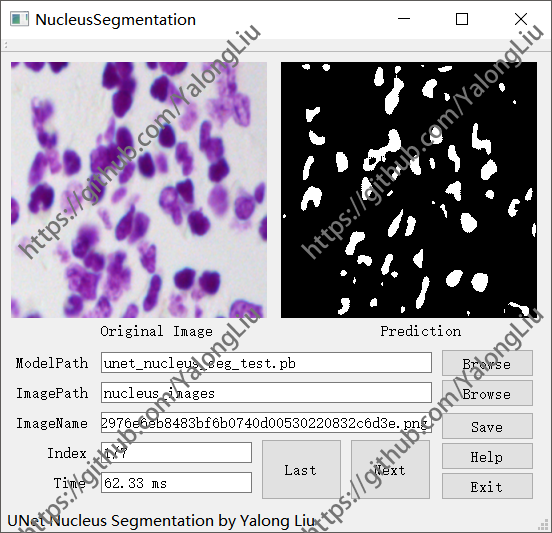

# NucleusSegmentation

a Tiny UNet Nucleus Segmentation Test GUI by Qt C++.  

---  

  

### Notes:
1.All codes wirten in Qt(C++) by Yalong Liu.  
2.All codes tested ok on Windows 10 x64.  
3.The CNN used here is a simplified UNet and the code is just for test.  
4.Other questions please contect me and I'll solve it in the first time.

### Usage:
1.Click the first "Browse" button to select the unet_nucleus_seg_test.pb file.  
2.Click the second "Browse" button to select a nucleus image folder.  
3.Click the "Last" or "Next" button for the last or next image.  
4.Wait for the result.

### Buttons:  
"Last": Process the last image in the ImagePath.  
"Next": Process the next image in the ImagePath.  
"Save": Save the Prediction image.  
"Help": Help information.  
"Exit": Exit the program.